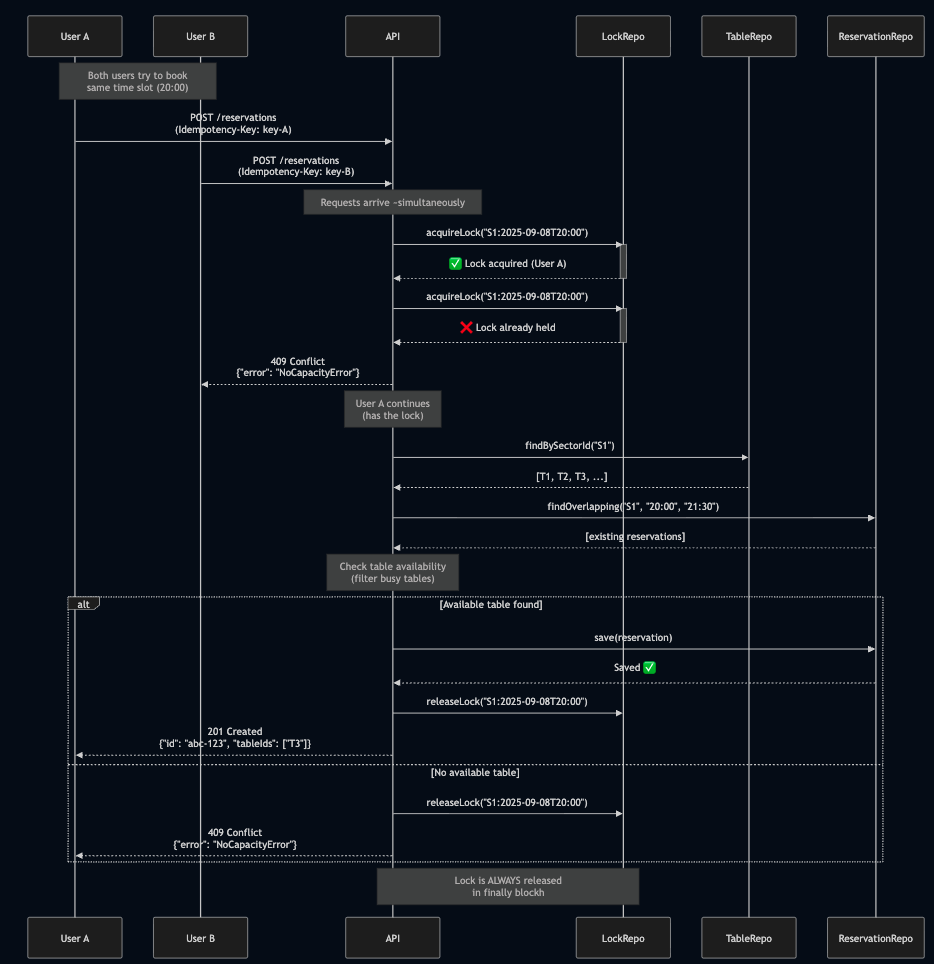

# Restaurant Reservation API

A lean, production-ready restaurant reservation engine built with **Node.js**, **TypeScript**, and **Hexagonal Architecture**.

## 🎯 Overview

Restaurant Reservation API is a scheduling kernel that handles table reservations with:

- **15-minute time slot granularity**
- **Automatic table assignment algorithm**
- **Concurrency control** (preventing double bookings)
- **Idempotency** (safe request retries)
- **Service shift support** (lunch/dinner windows)
- **Multi-sector management** (different restaurant areas)

## 🏗️ Architecture

### Hexagonal Architecture (Ports & Adapters)

```
src/
├── domain/                    # Business entities and rules (core)
│   ├── entities.ts           # Restaurant, Sector, Table, Reservation, Customer, ReservationStatus enum
│   ├── errors.ts             # Domain-specific errors (ValidationError, NotFoundError, etc.)
│   └── ports/
│       └── repositories.ts   # Repository interfaces (ports)
│
├── application/               # Use cases (application logic)
│   ├── usecases/
│   │   ├── CheckAvailabilityUseCase.ts
│   │   ├── CreateReservationUseCase.ts
│   │   ├── CancelReservationUseCase.ts
│   │   └── ListReservationsUseCase.ts
│   └── utils/
│       └── dateTimeUtils.ts  # Time slot generation, shift validation
│
└── infrastructure/            # External adapters
    ├── http/                  # REST API controllers
    │   ├── AvailabilityController.ts
    │   ├── ReservationController.ts
    │   ├── schemas.ts         # Zod validation schemas
    │   ├── requestIdMiddleware.ts
    │   ├── errorHandler.ts    # Maps errors to HTTP status codes
    │   └── app.ts             # Express app setup with Pino logging
    ├── logging/
    │   └── logger.ts          # Pino logger configuration
    ├── repositories/          # In-memory implementations
    │   ├── InMemoryRestaurantRepository.ts
    │   ├── InMemorySectorRepository.ts
    │   ├── InMemoryTableRepository.ts
    │   ├── InMemoryReservationRepository.ts
    │   ├── InMemoryIdempotencyKeyRepository.ts
    │   └── InMemoryLockRepository.ts
    └── database/
        └── seedData.ts        # Test data
```

### Design Decisions & Trade-offs

#### 1. **Hexagonal Architecture**

- ✅ **Benefit**: Domain logic is isolated from infrastructure (easy to swap databases, add GraphQL, etc.)
- ✅ **Benefit**: Testable (use cases can be tested without HTTP/DB)
- ⚠️ **Trade-off**: More files/abstractions for a small project

#### 2. **In-Memory Storage**

- ✅ **Benefit**: Zero setup, fast development, perfect for prototypes
- ✅ **Benefit**: Simulates real DB operations with async/await
- ⚠️ **Production**: Would use PostgreSQL with transactions or Redis for locks

#### 3. **Table Assignment Algorithm** (Efficient)

- **How it works**:
  1. Filter tables by capacity constraints (`minSize ≤ partySize ≤ maxSize`)
  2. Query overlapping reservations in O(N) time
  3. Build a set of busy table IDs (O(M) where M = overlapping reservations)
  4. Return first available table using Set lookup (O(1) per table)
- **Complexity**: O(N + M) where N = tables, M = reservations
- **Optimization**: Could use interval trees for very large datasets

#### 4. **Concurrency Control**

- **Mechanism**: Optimistic locking via `LockRepository`
- **How it works**:
  - Lock key: `reservation:{sectorId}:{startTimeISO}`
  - First request acquires lock, others fail fast with 409
  - Lock released in `finally` block
- ⚠️ **Production**: Use Redis distributed locks (Redlock) or DB row-level locks

**Concurrency Flow Diagram** (Two Users Booking Simultaneously):



**Key Points**:

1. **Atomic Lock Acquisition**: Only ONE request can acquire the lock for a given sector+time
2. **Fast Failure**: User B fails immediately (no wasted computation)
3. **Lock Scope**: `reservation:{sectorId}:{startTimeISO}` (granular, allows parallel bookings in different sectors/times)
4. **Guaranteed Release**: `finally` block ensures lock is released even on errors
5. **Idempotency Keys**: Different keys (`key-A`, `key-B`) ensure both are treated as separate requests

**Without Locks** (❌ Race Condition):

```
User A reads: 3 tables available
User B reads: 3 tables available  ← Both see same state
User A books Table T3
User B books Table T3  ← DOUBLE BOOKING! ❌
```

**With Locks** (✅ Serialized Access):

```
User A acquires lock → checks availability → books T3 → releases lock
User B waits/fails → gets 409 or retries after lock release
```

#### 5. **Idempotency**

- **Mechanism**: `Idempotency-Key` header mapped to reservation ID
- **Benefit**: Safe retries (network failures, duplicate form submissions)
- **Storage**: In-memory map (would use Redis with TTL in production)

#### 6. **Time Handling**

- **Library**: `date-fns` + `date-fns-tz` (lightweight, immutable)
- **Why not Moment.js**: Deprecated; date-fns is tree-shakeable
- **Timezone**: Stored at restaurant level (IANA format)
- **Interval semantics**: Half-open `[start, end)` (end exclusive)

## 🚀 Getting Started

### Prerequisites

- Node.js 18+
- npm or yarn

### Installation

```bash
# Install dependencies
npm install

# Run in development mode
npm run dev

# Or build and run production
npm run build
npm start
```

The API will start on `http://localhost:3000`

### Running Tests

```bash
# Run all tests (unit + integration)
npm test

# Run tests in watch mode
npm run test:watch

# Run tests with coverage
npm test -- --coverage
```

**Test Coverage**:

- ✅ **44 unit and integration tests**
- ✅ **Use case tests** (CheckAvailability, CreateReservation, CancelReservation, ListReservations)
- ✅ **Integration tests** (Full API endpoints with real HTTP requests)
- ✅ **Boundary cases** (adjacent reservations, end-exclusive intervals)
- ✅ **Error scenarios** (validation, not found, no capacity, concurrency)

### Test Data

The server automatically seeds one restaurant on startup:

- **Restaurant**: `Test Restaurant` (ID: `R1`)

  - Timezone: `America/Argentina/Buenos_Aires`
  - Shifts:
    - Lunch: 12:00 - 16:00
    - Dinner: 20:00 - 00:00

- **Sectors**:

  - `Main Hall` (ID: `S1`) - 6 tables
  - `Terrace` (ID: `S2`) - 4 tables

- **Tables**: 10 tables with capacity ranges (1-2, 3-4, 5-8 people)

## 📡 API Endpoints

### 1. Check Availability

```http
GET /availability?restaurantId=R1&sectorId=S1&date=2025-09-08&partySize=4
```

**Response** (200 OK):

```json
{
  "slotMinutes": 15,
  "durationMinutes": 90,
  "slots": [
    {
      "start": "2025-09-08T20:00:00.000Z",
      "available": true,
      "tables": ["T3", "T4", "T5"]
    },
    {
      "start": "2025-09-08T20:15:00.000Z",
      "available": false,
      "reason": "no_capacity"
    }
  ]
}
```

### 2. Create Reservation

```http
POST /reservations
Idempotency-Key: unique-key-123

{
  "restaurantId": "R1",
  "sectorId": "S1",
  "partySize": 4,
  "startDateTimeISO": "2025-09-08T20:00:00-03:00",
  "customer": {
    "name": "John Doe",
    "phone": "+54 9 11 5555-1234",
    "email": "john.doe@mail.com"
  },
  "notes": "Anniversary dinner"
}
```

**Response** (201 Created):

```json
{
  "id": "abc-123-uuid",
  "restaurantId": "R1",
  "sectorId": "S1",
  "tableIds": ["T4"],
  "partySize": 4,
  "start": "2025-09-08T20:00:00-03:00",
  "end": "2025-09-08T21:30:00-03:00",
  "status": "CONFIRMED",
  "customer": {
    "name": "John Doe",
    "phone": "+54 9 11 5555-1234",
    "email": "john.doe@mail.com",
    "createdAt": "2025-09-08T19:50:00.000Z",
    "updatedAt": "2025-09-08T19:50:00.000Z"
  },
  "notes": "Anniversary dinner",
  "createdAt": "2025-09-08T19:50:00.000Z",
  "updatedAt": "2025-09-08T19:50:00.000Z"
}
```

**Error Responses**:

- `400` - Invalid input (missing fields, bad format)
- `404` - Restaurant/sector not found
- `409` - No available tables
- `422` - Outside service window

### 3. Cancel Reservation

```http
DELETE /reservations/{id}
```

**Response**: `204 No Content`

### 4. List Reservations for a Day

```http
GET /reservations/day?restaurantId=R1&date=2025-09-08
GET /reservations/day?restaurantId=R1&date=2025-09-08&sectorId=S1  # Filter by sector
```

**Response** (200 OK):

```json
{
  "date": "2025-09-08",
  "items": [
    {
      "id": "abc-123",
      "sectorId": "S1",
      "tableIds": ["T4"],
      "partySize": 4,
      "start": "2025-09-08T20:00:00-03:00",
      "end": "2025-09-08T21:30:00-03:00",
      "status": "CONFIRMED",
      "customer": { "name": "John Doe", "phone": "...", "email": "..." },
      "createdAt": "...",
      "updatedAt": "..."
    }
  ]
}
```

## 🧪 Automated Tests

The API includes a comprehensive test suite with **44 tests** covering unit and integration scenarios.

### Test Suite Overview

- **Unit Tests**: 26 tests for use cases (business logic)
- **Integration Tests**: 18 tests for API endpoints (HTTP layer)
- **Test Coverage**: High coverage of critical paths

See [TESTING.md](./TESTING.md) for detailed test documentation.

### Run Tests

```bash
# Run all tests
npm test

# Run in watch mode
npm run test:watch

# With coverage report
npm test -- --coverage
```

### Test Results

```
Test Suites: 5 passed
Tests:       44 passed
Duration:    ~2.7s
```

**Key Scenarios Tested:**

- ✅ Availability checking with service windows
- ✅ Reservation creation with table assignment
- ✅ Idempotency (duplicate key handling)
- ✅ Concurrency control (lock mechanism)
- ✅ Capacity management (409 when full)
- ✅ Service window validation (422 outside shifts)
- ✅ Cancellation and table availability
- ✅ Half-open interval semantics [start, end)

## 🧪 Manual Testing

### Testing with curl

#### 1. Check availability

```bash
curl "http://localhost:3000/availability?restaurantId=R1&sectorId=S1&date=2025-09-08&partySize=4"
```

#### 2. Create a reservation

```bash
curl -X POST http://localhost:3000/reservations \
  -H "Content-Type: application/json" \
  -H "Idempotency-Key: test-key-1" \
  -d '{
    "restaurantId": "R1",
    "sectorId": "S1",
    "partySize": 4,
    "startDateTimeISO": "2025-09-08T20:00:00-03:00",
    "customer": {
      "name": "John Doe",
      "phone": "+54 9 11 5555-1234",
      "email": "john@example.com"
    }
  }'
```

#### 3. Test idempotency (same key, same result)

```bash
curl -X POST http://localhost:3000/reservations \
  -H "Content-Type: application/json" \
  -H "Idempotency-Key: test-key-1" \
  -d '{ ... same payload ... }'
```

#### 4. Test concurrency (try to book same slot)

```bash
# Run two requests simultaneously (should get one 201, one 409)
curl -X POST http://localhost:3000/reservations -H "Idempotency-Key: key-A" -d '...' &
curl -X POST http://localhost:3000/reservations -H "Idempotency-Key: key-B" -d '...' &
```

#### 5. List reservations

```bash
curl "http://localhost:3000/reservations/day?restaurantId=R1&date=2025-09-08"
```

#### 6. Cancel reservation

```bash
curl -X DELETE http://localhost:3000/reservations/{reservation-id}
```

#### 7. Test outside service window (should fail with 422)

```bash
curl -X POST http://localhost:3000/reservations \
  -H "Idempotency-Key: test-key-outside" \
  -d '{
    "restaurantId": "R1",
    "sectorId": "S1",
    "partySize": 4,
    "startDateTimeISO": "2025-09-08T18:00:00-03:00",
    "customer": { "name": "Test", "phone": "123", "email": "test@test.com" }
  }'
```
